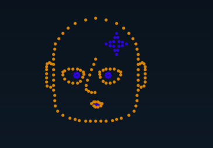
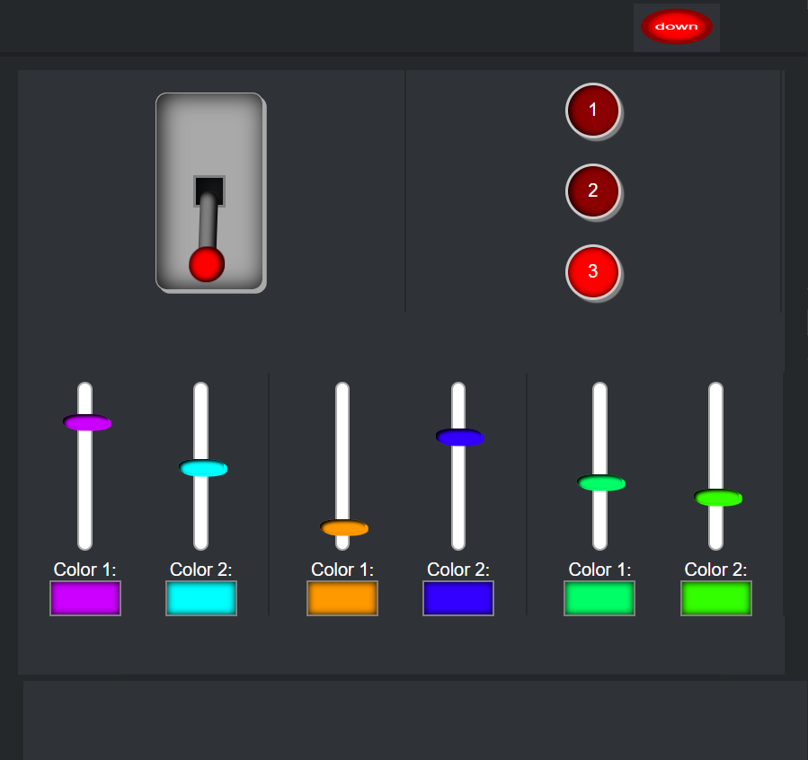
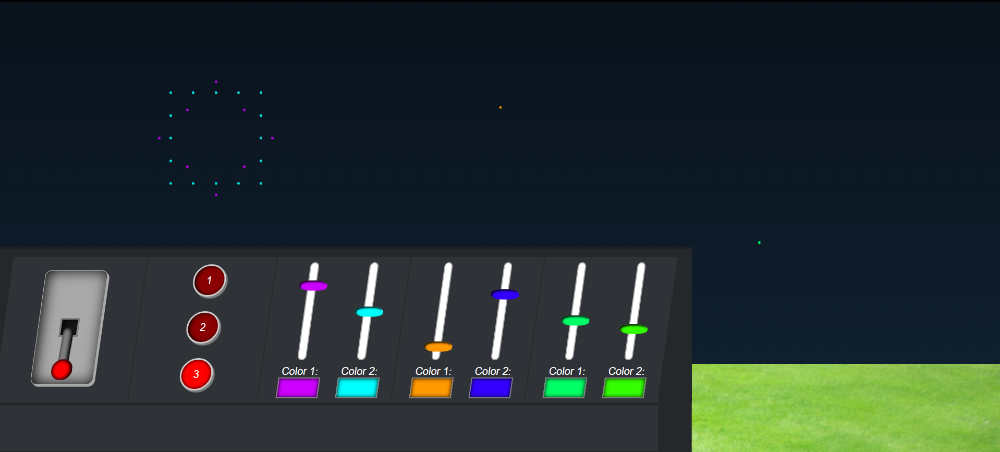

# CSS to the rescue

This is a repository for my school project.

In this readme i will be describing my project and my improvements along the way

Made by:

- [@Stef Keuken](https://www.github.com/kitch41)

## My Idea

The idea i had when i was starting this project was a control panel that controls a firework show. This way i can combine 2 things into 1. I made some sketches to display what i was trying to do


## My first demo

After i made my sketches i started coding a bit to try and get a feel for what i wanted. I quickly made some nice radiobuttons i am going to use for changing the amount of fireworks being launched.

Then i tried to build a good looking lever using animations, But after a very long time when i finally finished it i heard from sanne there was another way easier way of doing it that looked better aswell. So below i will show my code before the change.

<a href="https://codepen.io/Kitch41/pen/eYoObJK?editors=1100">Link</a>

<details>
  <summary>The Code for the lever (old)</summary>

  ``` css

/* ============================*/
/* ===========Lever============*/
/* ============================*/


/* ===========Label============*/

section > ul > li:nth-child(1) > label {
  position: relative;
  display: inline-block;
  height: 150px;
  width: 80px;

}

/* ===========Checkbox============*/

section > ul > li:nth-child(1) > label input {
  opacity: 0;
  width: 0;
  height: 0;
}

/* ===========Slider============*/

section > ul > li:nth-child(1) > label span {
  position: absolute;
  cursor: pointer;
  top: 0;
  left: 0;
  right: 0;
  bottom: 0;
  background-color: #ccc;
  -webkit-transition: .4s;
  transition: .4s;
  box-shadow: 0 0 2px 5px darkgrey inset;
}

section > ul > li:nth-child(1) > label span:before {
  position: absolute;
  content: "";
  width: 50px;
  height: 50px;
  top: -35px;
  left: 19%;
  margin-top: 13px;
  background-color: red;
  box-shadow: 0 0 6px black inset;
  -webkit-transition: 2s;
  transition: 2s;
  border-radius: 50%;
  z-index: 1;
}

section > ul > li:nth-child(1) > label span:after {
  position: absolute;
  content: "";
  width: 15px;
  height: 70px;
  top: 0;
  left: 40%;
  margin-top: 13px;
  background-color: darkgrey;
  box-shadow: 0 0 6px black inset;
  -webkit-transition: 2s;
  transition: 2s;
  z-index: 0;
  border-radius: 10px;
}

section > ul > li:nth-child(1) > label > input:focus + span {
  box-shadow: 0 0 2px 5px darkgrey inset;
}

section > ul > li:nth-child(1) > label > input:checked + span:before {
  -webkit-transform: translatey(150px);
  -ms-transform: translatey(150px);
  transform: translatey(150px);
}

section > ul > li:nth-child(1) > label > input:checked + span:after {
  animation: flip 2s forwards;
  
}

section > ul > li:nth-child(1) > label > input:not(:checked) + span:after {
  animation: reverseFlip 2s forwards;
  
}

section > ul > li:nth-child(1) > label > div {
  width: 10em;
  height: 10em;
  
}

@keyframes flip {
  0% {
    height: 70px;
    top: 0;
  }
  

  20% {
    height: 50px;
    top: 20px;
  }
  
  33% {
    height: 0;
    top: 55px;
  }
  
  37% {
    height: 30px;
    top: 55px;
  }
 
  
  70% {
    height: 70px;
    top: 55px;
  }
 
    100% {
    height: 70px;
    top: 55px;
  }
  
}

@keyframes reverseFlip {
  0% {
    height: 70px;
    top: 55px;
  }
  
  5% {
    height: 70px;
    top: 55px;
  }

  40% {
    height: 0px;
    top: 55px;
  }

  41% {
    height: 20px;
    top: 50px;
  }
  
  70% {
    height: 70px;
    top: 0;
  }
  

  100% {
    height: 70px;
    top: 0;
  }
}


```
  
</details>

<details>
  <summary>The Code for the lever (new)</summary>

  ``` css


```
  
</details>

## The next step

After this demo i started really working hard on codepen to create something that would be easily transferred to vscode and not to complicated so i could keep using codepen. This lasted a little while until it got too complicated and i had to switch from codepen to visual studio code.

In this codepen i got the console looking good and working properly. I just needed to create the fireworks myself and add the functionality to the controls on the panel.

### My codepen

https://codepen.io/Kitch41/pen/NWmWQxr


## Sannehoofd

After i switched from codepen to visual studio code i had an amazing idea so i started making my teachers head in my fireworks show. It took me a whole day just to setup the dots in the right place. But im happy its looking this good.




## Responsive

The biggest challenge i walked into was making the whole thing responsive. At first i tried doing it the simple way. By just making the panel width: 100vw. But it turns out that i needed a lot more space so i started to work with animations. After a while i made some pretty awesome animations and managed to fit all the features into 1 panel. So the app works on mobile and desktop.



## Conclusion



There are a few things i wish i could've still done had i had more time.

I would've liked to add some custom shapes into a panel. so you can choose the shape you like.
I also would've liked to make it more of a show. So make it look a little random and not have thesame fireworks over and over again.

There are some other things i would like to still create but these are the best ones.

### Improvement

I improved a lot with this project. Mostly in creating 3d, Animations and how to create some fireworks using background gradients.

